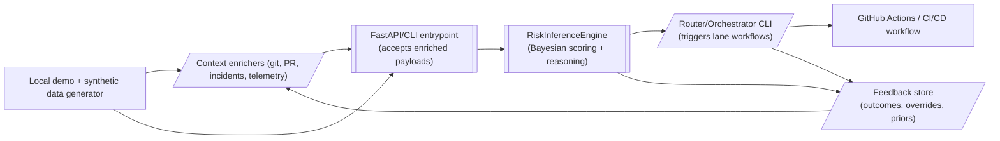

# Architecture Overview

`Probabilistic Pipeline` is composed of three logical layers:

1. **Adapters / context enrichers** (e.g., `ContextEnricher`) ingest metadata from git history, PR metadata, and incidents, normalize it into signal vectors, and populate `domain_familiarity_score` / `past_success_rate` before invoking the core.
2. **Inference core** fuses signals into a Bayesian risk score, reasons about uncertainty, and maps confidence to deployment lanes.
3. **Integrations** expose the score back into CI/CD (CLI output, GitHub status, deployment lane metadata) while honoring policy floors.

## Signal adapters
Each adapter is responsible for a single data source. Adapters should:
- Be pluggable and injectable via dependency configuration so new sources (CMDB, incident history, observability feeds) can plug in without touching the core.
- Emit structured metrics such as `confidenceDelta`, `signalCompleteness`, and `reasonSnippet`.
- Tag data with provenance so operators can trace the score back to the source.

Initial adapters:
| Signal | Description | Source |
| --- | --- | --- |
| `codeChurn` | Diff size/complexity + touched modules | Git metadata / diff analyzer |
| `systemHealth` | Error rate, latency, CPU/mem trends | Observability API (Prometheus, Datadog) |
| `authorPersona` | Historical success rate for module + expertise tier | Internal contributor DB or GitHub analytics |
| `fileHistory` | Whether touched files are hotspots from past incidents | Incident database, CODEOWNERS, ticket metadata |

## Inference core
- Maintain a configurable prior per module/service to capture historical risk tolerance.
- Score each adapter output as a likelihood that the change is risky.
- Apply a **Pessimism Bias** (add +15% risk) any time a mandatory signal is absent or its completeness is below threshold.
- Fuse likelihoods via Bayesian updating to compute a `confidenceScore` (0-100%).
- Include a `reasoning` field summarizing the dominant signals and lacking data.
- Always enforce the **Hard Floor**: if security/compliance scans are missing/failed, override the output to force manual gates regardless of score.

## Deployment lanes
- `Low Risk` (<20%): Auto-canary with minimal human intervention.
- `Medium Risk` (20-70%): Integration tests + explicit manual approval.
- `High Risk` (>70%): Senior review and extended soak time.
- A `reasoning` payload travels with each lane recommendation, plus a `laneMetadata` object that details which signals influenced the decision.

## Integrations
- Provide both a CLI runner and a GitHub Action to execute the engine inside pipelines.
- Emit a JSON artifact that downstream tasks (notifications, dashboards) can consume.
- Surface a `scorecard` summary in pipeline logs, including reasoning snippets and missing-data warnings.
- Offer an `adapter registry` so new sources (CMDB, incident systems, compliance data) can be enabled explicitly per environment.

# Flow overview

